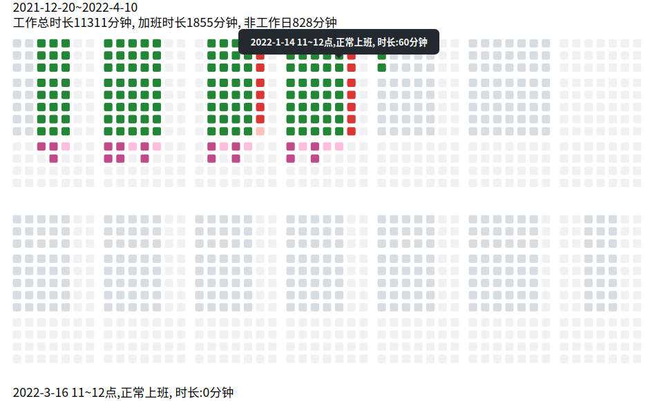

Bricka
===============

优雅的统计和展示工作时长





## 简介

一款kotlin开发的命令行工具，由于记录每天工作时间,并通过一种只管的方式展示出来

设计灵感来自于github contribution wall

精确到分.

用颜色区分了正常工作、日常加班、周末加班。

鼠标悬浮可以显示每个小时的统计


## 使用方法

### 查看使用帮助

```
java -jar bricka.jar -h
```

### 记录
统计依赖于一个在后台运行的daemon程序进行统计， 需要将这个jar包设置为开机自动运行，以Linux系统为例，需要进行以下设置

创建/path/to/brickmoving/wrapper.sh
```
#!/bin/bash

WORKDIR=/path/to/brickmoving

cd $WORKDIR
"${JAVA_HOME}/bin/java" -jar bricka.jar -d
```

```
ls
bricka.jar  wrapper.sh
```


创建 /etc/systemd/system/bricka.service 
```
[Unit]
Description=sunday monday service
After=syslog.target network.target
[Service]
SuccessExitStatus=143
ExecStart=/path/to/brickmoving/wrapper.sh
ExecStop=/bin/kill -15 $MAINPID

[Install]
WantedBy=multi-user.target
```

执行
```
systemctl enable bricka.service
systemctl start bricka.service
systemctl status bricka.service
```

### 查看统计,输出html
```
cd /path/to/brickmoving
#查看使用帮助
java -jar bricka.jar -h
java -jar bricka.jar -s 2022-1-1 -e 2022-2-2

```


本项目主要使用了以下优秀的开源项目

* sqlite-jdbc
* jcommander


